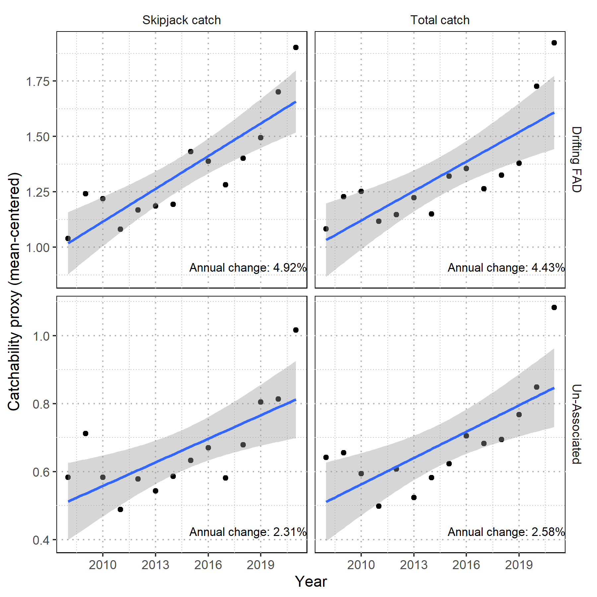

# 2025-skj-catchability

This repository contains an R script that calculates a free-school catchability proxy for skipjack tuna in the Western and Central Pacific Ocean (WCPO), following the methodology described in [Hamer et al. (2024)](https://meetings.wcpfc.int/node/22984).



## Overview

The script `catchability_proxy.r` analyzes purse seine catch data and biomass estimates to calculate a catchability proxy, which is then used to assess potential effort creep in the WCPO purse seine fishery. Effort creep refers to the gradual increase in fishing efficiency over time due to technological improvements or changes in fishing practices.

## Methodology

The analysis follows these steps:

1. Extract public purse seine catch data and restrict to assessment regions 6-8
2. Process data for both unassociated (free-school) and drifting FAD fishing methods
3. Extract biomass estimates from the 2022 skipjack diagnostic stock assessment model
4. Calculate catchability proxy as catch/(sets × biomass)
5. Normalize the proxy by setting the mean value to 1.0
6. Perform linear regression to estimate annual percent change
7. Generate visualizations of catchability trends

## Findings

The analysis reveals that the annual catchability proxy increases by approximately 2.5% for free-school using set as the effort metric. However, the proposed free-school index for the 2025 WCPO skipjack tuna stock assessment defines effort as distance traveled from a previous set. Previous work in support of the 2022 WCPO skipjack tuna stock assessment ([Teears et al., 2022](https://meetings.wcpfc.int/node/16253), Figure 14) did not indicate an appreciable change to the trend in the index when defining effort using distance traveled rather than set.


## Data Sources

- WCPFC public data repository: [Purse seine catch data](https://www.wcpfc.int/node/4648)
- 2022 skipjack stock assessment ([diagnostic case T2G10.8](https://oceanfish.spc.int/en/ofpsection/sam/sam/213-skipjack-assessment-results#2022)) for biomass estimates

## Requirements

The script requires the following R packages:
- data.table
- magrittr
- FLR4MFCL
- ggplot2
- this.path

## Getting Started
This project uses `renv` for package management to ensure reproducibility across environments. The repository is also configured to work with GitHub Codespaces for cloud-based development.

### Running the Models Locally
First, [clone](https://docs.github.com/en/repositories/creating-and-managing-repositories/cloning-a-repository) this repository to your local machine.

#### Using Base R
1. Open an R terminal (recommended [version 4.4.0](https://cloud.r-project.org/) with RTools 4.4 installed)
2. Set your working directory to the cloned repository:
   ```r
   setwd("path/to/repository/")
   ```
3. Source the `.Rprofile` file to bootstrap `renv`:
   ```r
   source(".Rprofile")
   ```
4. If `renv` doesn't bootstrap automatically, run:
   ```r
   renv::restore()
   ```
5. Follow the prompts to install all required packages (including `data.table`, `magrittr`, `ggplot2`, `FLR4MFCL`, and other dependencies)

#### Using RStudio
1. Open the repository as an [RStudio Project](https://bookdown.org/ndphillips/YaRrr/projects-in-rstudio.html)
2. RStudio should automatically detect the `renv` configuration and prompt for package installation
3. If `renv` doesn't bootstrap automatically, run:
   ```r
   renv::restore()
   ```

#### Using Visual Studio Code
1. Configure VS Code to work with R using the [R extension](https://github.com/REditorSupport/vscode-R)
2. Follow the specific [configuration steps for renv projects](https://github.com/REditorSupport/vscode-R/wiki/Working-with-renv-enabled-projects)
3. Open the repository folder in VS Code
4. Open an R terminal, which should prompt `renv` to bootstrap
5. If `renv` doesn't bootstrap automatically, run:
   ```r
   renv::restore()
   ```

## License

The code contained in this repository is licensed under the GNU GENERAL PUBLIC LICENSE version 3 ([GPLv3](https://www.gnu.org/licenses/gpl-3.0.html)).

## Disclaimer

This repository is a scientific product and is not official communication of the National Oceanic and Atmospheric Administration, or the United States Department of Commerce. All NOAA GitHub project code is provided on an ‘as is’ basis and the user assumes responsibility for its use. Any claims against the Department of Commerce or Department of Commerce bureaus stemming from the use of this GitHub project will be governed by all applicable Federal law. Any reference to specific commercial products, processes, or services by service mark, trademark, manufacturer, or otherwise, does not constitute or imply their endorsement, recommendation or favoring by the Department of Commerce. The Department of Commerce seal and logo, or the seal and logo of a DOC bureau, shall not be used in any manner to imply endorsement of any commercial product or activity by DOC or the United States Government.
